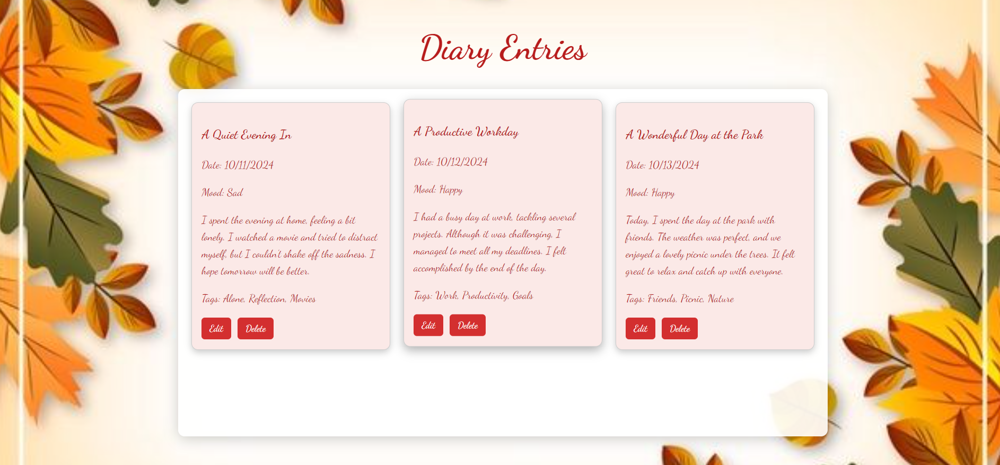

# Unit 5 - Final Project

This is the Unit 5 final project, where I built a Diary Entry Application that allows users to create, read, update, and delete diary entries. The application integrates a beautiful UI, handles user inputs efficiently, and utilizes a robust back-end service for handling data storage and operations. This project demonstrates the essential components of a full-stack application, including front-end UI/UX design, back-end server implementation, and API integration. It supports essential CRUD operations and provides a polished and user-friendly interface for interacting with diary entries.

## Tech Stack

**Front-End:**
- **React-Vite**: JavaScript framework for building UI.

**Back-End:**
- **Node.js**: JavaScript runtime for building server-side logic.
- **Express**: Node.js web framework.

**Database:**
- **MongoDB**: NoSQL database for storing diary entries.

## How to Run the Dear Diary Project

To test the Dear Diary project, follow these steps to run both the backend server and the frontend application. Ensure you have Node.js and npm installed on your machine.

### Project Structure
- **dear-diary-BACKEND**: This folder contains the backend server code.
- **vite-project-FRONTEND**: This folder contains the frontend application built with Vite.

### Step 1: Run the Backend Server

1. **Navigate to the Backend Folder**: 
   Open your terminal and change the directory to the backend project folder:
    
2. Start the Backend Server: **npm start**
3. The server should now be running on http://localhost:5000
   

### Step 2: Run the Frontend Application

1. **Navigate to the Frontend Folder**:
    Open a New Terminal Window: After the backend server is running, open a new terminal window or tab. 

2. Start the Frontend Application: npm run dev
3. The frontend should now be running on http://localhost:5173

## Accessing the Application

Once both the backend and frontend are running, you can access the **Dear Diary** application by navigating to [http://localhost:5173](http://localhost:5173) in your web browser. 

From the application interface, you will be able to:
- **Create** new diary entries
- **Read** existing diary entries
- **Update** diary entries
- **Delete** diary entries

##Screenshots:

